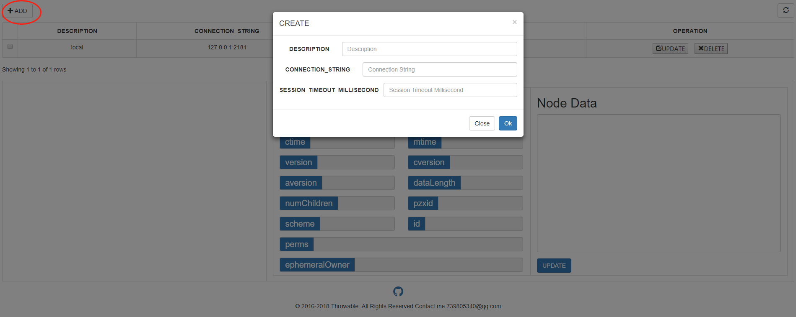
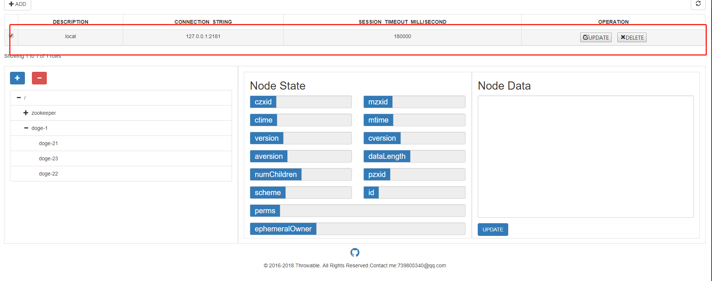
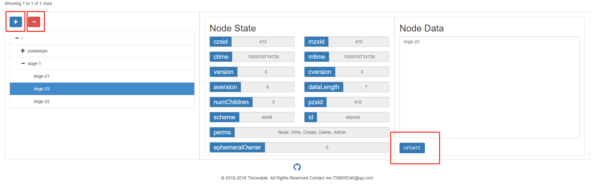

## 简介
zookeeper-console是一款基于SpringBoot、Curator、Bootstrap开发的Zookeeper可视化Web应用。

## 运行环境
- Jdk：1.8
- Zookeeper：3.4.10

其他版本尚未做兼容。

## 安装
### 本地运行
下载此项目到本地，用IDE打开项目，加载Maven依赖，配置Jdk，启动类是`club.throwable.zookeeper.console.ZookeeperConsoleApplication`，以main函数形式运行即可。嵌入式Tomcat默认的启动端口为9091，访问localhost:9091/进入操作页面。
### 打包
下载此项目到本地，进入项目目录，控制台运行Maven命令`mvn package`，即可打包为jar包`zookeeper-console.jar`。通过java -jar zookeeper-console.jar运行即可。嵌入式Tomcat默认的启动端口为9091，访问localhost:9091/进入操作页面。

## 使用方法
- 1、通过ADD按钮添加一个Zookeeper配置。

- 2、点击选择一行Zookeeper配置，加载Zookeeper路径树。

- 3、点击树路径节点，即可看到节点状态和数据，可以对节点进行增、删和数据更新操作。

